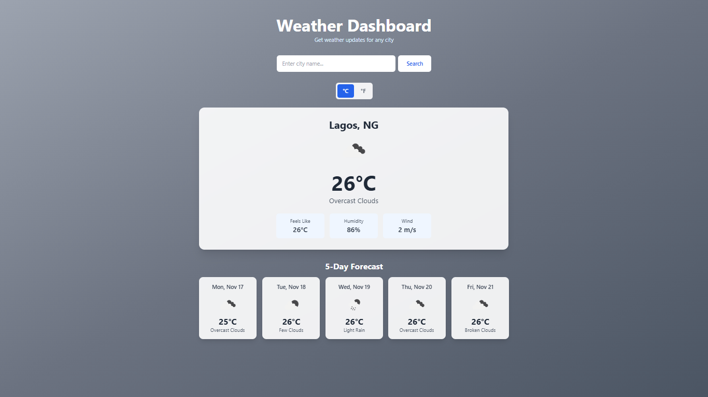

# Weather Dashboard 🌤️

A modern, responsive weather dashboard built with React and Tailwind CSS that displays current weather conditions and a 5-day forecast for any city worldwide.

## Features

- 🔍 **City Search** - Search weather for any city globally
- 🌡️ **Temperature Toggle** - Switch between Celsius and Fahrenheit
- 🎨 **Dynamic Backgrounds** - Background gradients change based on weather conditions
- 📊 **Current Weather** - Displays temperature, weather condition, humidity, wind speed, and "feels like" temperature
- 📅 **5-Day Forecast** - View upcoming weather predictions
- ⚡ **Real-time Data** - Powered by OpenWeatherMap API
- 📱 **Responsive Design** - Works seamlessly on desktop and mobile devices
- ⌨️ **Keyboard Support** - Press Enter to search

## Demo



**Live Demo:** [https://weather-dashboard.vercel.app]

## Technologies Used

- **React** - Frontend framework
- **Vite** - Build tool and dev server
- **Tailwind CSS** - Styling
- **Axios** - HTTP requests
- **OpenWeatherMap API** - Weather data

## Installation & Setup

### Prerequisites

- Node.js (v14 or higher)
- npm or yarn
- OpenWeatherMap API key

### Steps

1. **Clone the repository**

   ```bash
   git clone https://github.com/leogabson/weather-dashboard.git
   cd weather-dashboard
   ```

2. **Install dependencies**

   ```bash
   npm install
   ```

3. **Get your API key**

   - Go to [OpenWeatherMap](https://openweathermap.org/api)
   - Sign up for a free account
   - Navigate to "API keys" and copy your key
   - Wait 5-10 minutes for the key to activate

4. **Create environment file**

   Create a `.env` file in the project root:

   ```
   VITE_WEATHER_API_KEY=your_api_key_here
   ```

5. **Run the development server**

   ```bash
   npm run dev
   ```

6. **Open your browser**

   Navigate to `http://localhost:5173`

## Building for Production

```bash
npm run build
```

The build files will be in the `dist` folder, ready for deployment.

## Deployment

This project can be easily deployed to:

- **Vercel** - `vercel --prod`
- **Netlify** - Drag and drop the `dist` folder or connect your GitHub repo
- **GitHub Pages** - Follow [Vite's static deployment guide](https://vitejs.dev/guide/static-deploy.html)

**Important:** Remember to add your `VITE_WEATHER_API_KEY` environment variable in your deployment platform's settings.

## Usage

1. Enter a city name in the search bar
2. Press Enter or click the Search button
3. View current weather and 5-day forecast
4. Toggle between Celsius and Fahrenheit using the temperature switcher
5. Watch the background change based on weather conditions

## Project Structure

```
weather-dashboard/
├── src/
│   ├── App.jsx          # Main application component
│   ├── index.css        # Tailwind imports
│   └── main.jsx         # App entry point
├── public/
├── .env                 # Environment variables (not tracked)
├── .gitignore
├── index.html
├── package.json
├── tailwind.config.js
├── vite.config.js
└── README.md
```

## API Reference

This project uses the [OpenWeatherMap API](https://openweathermap.org/api):

- **Current Weather**: `/data/2.5/weather`
- **5-Day Forecast**: `/data/2.5/forecast`

## Future Enhancements

- [ ] Add geolocation to detect user's current location
- [ ] Add more detailed weather metrics (UV index, visibility, air quality)
- [ ] Implement weather alerts and warnings
- [ ] Add search history and favorite cities
- [ ] Dark/light mode toggle
- [ ] Hourly forecast view

## License

This project is open source and available under the [MIT License](LICENSE).

## Contact

COntact me: gabrielehuwa92@gmail.com

Project Link: [https://github.com/leogabson/weather-dashboard](https://github.com/leogabson/weather-dashboard)

---
